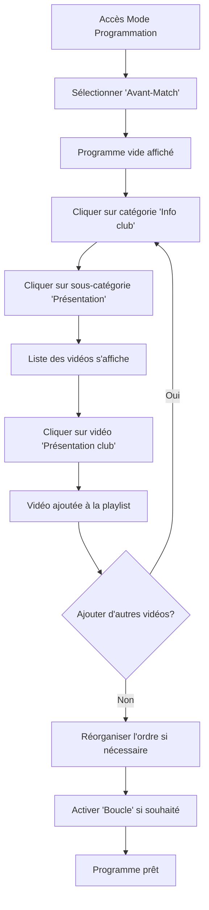
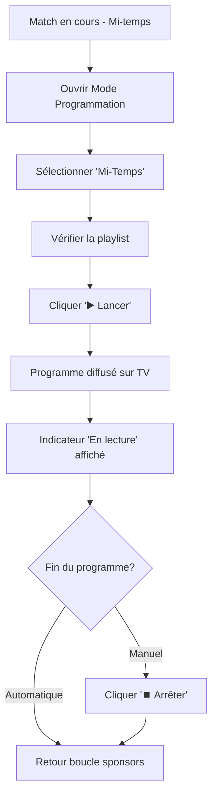

# 🎬 Maquette du Mode Programmation

## Vue d'ensemble

Le Mode Programmation permet de créer et gérer des playlists automatiques pour trois moments clés d'un match :
- **Avant-Match** 🏁 : Échauffement, présentation des équipes
- **Mi-Temps** ⏸️ : Pause publicitaire, résumé première mi-temps
- **Fin de Match** 🏆 : Célébration, résumé, remerciements

---

## 📱 Interface Principale

```
┌─────────────────────────────────────────────────────────────────────────┐
│  [← Retour]              Mode Programmation                             │
└─────────────────────────────────────────────────────────────────────────┘
┌──────────────┬──────────────────────────────────────────────────────────┐
│              │                                                           │
│  Programmes  │                                                           │
│  [+ Nouveau] │          Sélectionnez un programme                       │
│              │                                                           │
│ ┌──────────┐ │                      📋                                  │
│ │ 🏁       │ │                                                           │
│ │Avant-    │ │      Choisissez un programme dans la liste de gauche     │
│ │Match     │ │           ou créez-en un nouveau pour commencer          │
│ │3 vidéos  │ │                                                           │
│ │· 1:30    │ │                                                           │
│ └──────────┘ │                                                           │
│              │                                                           │
│ ┌──────────┐ │                                                           │
│ │ ⏸️       │ │                                                           │
│ │Mi-Temps  │ │                                                           │
│ │0 vidéo   │ │                                                           │
│ └──────────┘ │                                                           │
│              │                                                           │
│ ┌──────────┐ │                                                           │
│ │ 🏆       │ │                                                           │
│ │Fin de    │ │                                                           │
│ │Match     │ │                                                           │
│ │2 vidéos  │ │                                                           │
│ │· 0:45    │ │                                                           │
│ └──────────┘ │                                                           │
│              │                                                           │
└──────────────┴──────────────────────────────────────────────────────────┘
```

---

## 📝 Vue Édition d'un Programme

```
┌─────────────────────────────────────────────────────────────────────────┐
│  [← Retour]              Mode Programmation                             │
└─────────────────────────────────────────────────────────────────────────┘
┌──────────────┬──────────────────────────────────────────────────────────┐
│              │ ┌────────────────────────────────────────────────────┐   │
│  Programmes  │ │  Avant-Match                                       │   │
│  [+ Nouveau] │ │  ☑ Lecture auto    ☑ Boucle                       │   │
│              │ │         [✏️ Modifier]  [▶️ Lancer]                │   │
│ ┏━━━━━━━━━━┓ │ └────────────────────────────────────────────────────┘   │
│ ┃ 🏁       ┃ │                                                           │
│ ┃Avant-    ┃ │ ┌────────────────────────────────────────────────────┐   │
│ ┃Match     ┃ │ │  Playlist (3)                                      │   │
│ ┃3 vidéos  ┃ │ │                                                    │   │
│ ┃· 1:30    ┃ │ │  ⋮⋮ 1. Video BUT - Joueur 1       [↑][↓][✕]      │   │
│ ┗━━━━━━━━━━┛ │ │     Match SM1 › But                                │   │
│              │ │                                                    │   │
│ ┌──────────┐ │ │  ⋮⋮ 2. Jingle 2 minutes            [↑][↓][✕]      │   │
│ │ ⏸️       │ │ │     Match SM1 › Jingle                             │   │
│ │Mi-Temps  │ │ │                                                    │   │
│ │0 vidéo   │ │ │  ⋮⋮ 3. Présentation club           [↑][↓][✕]      │   │
│ └──────────┘ │ │     Info club › Présentation                       │   │
│              │ └────────────────────────────────────────────────────┘   │
│ ┌──────────┐ │                                                           │
│ │ 🏆       │ │ ┌────────────────────────────────────────────────────┐   │
│ │Fin de    │ │ │  Bibliothèque de vidéos                            │   │
│ │Match     │ │ │                                                    │   │
│ │2 vidéos  │ │ │  Catégorie:                                        │   │
│ │· 0:45    │ │ │  [Match SM1] [Match SF] [Focus partenaires]       │   │
│ └──────────┘ │ │                          [Info club]                │   │
│              │ │                                                    │   │
│              │ │  Sous-catégorie:                                   │   │
│              │ │  [But] [Jingle]                                    │   │
│              │ │                                                    │   │
│              │ │  🎬 Joueur 1          [+ Ajouter]                  │   │
│              │ │  🎬 Joueur 2          [+ Ajouter]                  │   │
│              │ │  🎬 Joueur 3          [+ Ajouter]                  │   │
│              │ └────────────────────────────────────────────────────┘   │
└──────────────┴──────────────────────────────────────────────────────────┘
```

---

## ▶️ Vue Programme en Lecture

```
┌─────────────────────────────────────────────────────────────────────────┐
│  [← Retour]              Mode Programmation                             │
└─────────────────────────────────────────────────────────────────────────┘
┌──────────────┬──────────────────────────────────────────────────────────┐
│              │ ┌────────────────────────────────────────────────────┐   │
│  Programmes  │ │  Avant-Match                                       │   │
│  [+ Nouveau] │ │  ☑ Lecture auto    ☑ Boucle                       │   │
│              │ │                            [⏹️ Arrêter]            │   │
│ ┏━━━━━━━━━━┓ │ └────────────────────────────────────────────────────┘   │
│ ┃ 🏁       ┃ │                                                           │
│ ┃Avant-    ┃ │ ┌────────────────────────────────────────────────────┐   │
│ ┃Match     ┃ │ │  Playlist (3)                                      │   │
│ ┃          ┃ │ │                                                    │   │
│ ┃ 🟢 En    ┃ │ │  ⋮⋮ 1. Video BUT - Joueur 1       [↑][↓][✕]      │   │
│ ┃ lecture  ┃ │ │     Match SM1 › But                   ◄ EN COURS  │   │
│ ┗━━━━━━━━━━┛ │ │                                                    │   │
│              │ │  ⋮⋮ 2. Jingle 2 minutes            [↑][↓][✕]      │   │
│ ┌──────────┐ │ │     Match SM1 › Jingle                             │   │
│ │ ⏸️       │ │ │                                                    │   │
│ │Mi-Temps  │ │ │  ⋮⋮ 3. Présentation club           [↑][↓][✕]      │   │
│ │0 vidéo   │ │ │     Info club › Présentation                       │   │
│ └──────────┘ │ └────────────────────────────────────────────────────┘   │
│              │                                                           │
│ ┌──────────┐ │  ⚠️ Le programme est en cours de lecture sur la TV      │
│ │ 🏆       │ │     Modifications désactivées                            │
│ │Fin de    │ │                                                           │
│ │Match     │ │                                                           │
│ │2 vidéos  │ │                                                           │
│ │· 0:45    │ │                                                           │
│ └──────────┘ │                                                           │
│              │                                                           │
└──────────────┴──────────────────────────────────────────────────────────┘
```

---

## 🎨 Palette de Couleurs

### Programmes par défaut
- **Avant-Match** 🏁 : Bleu clair `#667eea`
- **Mi-Temps** ⏸️ : Orange `#f59e0b`
- **Fin de Match** 🏆 : Vert `#10b981`

### États
- **Programme sélectionné** : Bordure violette `#667eea`, fond blanc
- **Programme en lecture** : Fond vert clair `#ecfdf5`, bordure verte `#10b981`
- **Bouton principal** : Gradient violet `#667eea` → `#764ba2`
- **Bouton secondaire** : Gris clair `#f3f4f6`
- **Bouton lecture** : Vert `#10b981`
- **Bouton arrêt** : Rouge `#ef4444`

---

## 📐 Wireframe Détaillé

### Barre latérale (320px)
```
┌────────────────────┐
│  Programmes        │
│  [+ Nouveau]       │
├────────────────────┤
│                    │
│  [Card Programme]  │ ← 100% largeur
│   - Icône          │   padding: 16px
│   - Nom            │   margin: 12px
│   - Stats          │   border-radius: 12px
│   - État lecture   │
│   - Bouton suppr.  │
│                    │
│  [Card Programme]  │
│                    │
│  [Card Programme]  │
│                    │
└────────────────────┘
```

### Zone principale (flex: 1)
```
┌─────────────────────────────────────────┐
│  [En-tête programme]                    │
│   - Nom (éditable si mode édition)      │
│   - Options (lecture auto, boucle)      │
│   - Boutons actions (modifier, lancer)  │
├─────────────────────────────────────────┤
│                                         │
│  [Playlist]                             │
│   - Liste items drag & drop             │
│   - Numéro, nom, catégorie              │
│   - Boutons ordre et suppression        │
│                                         │
├─────────────────────────────────────────┤
│                                         │
│  [Bibliothèque vidéos]                  │
│   - Sélecteur catégorie (boutons)      │
│   - Sélecteur sous-catégorie (boutons) │
│   - Grille de vidéos disponibles        │
│   - Bouton "+ Ajouter" par vidéo        │
│                                         │
└─────────────────────────────────────────┘
```

---

## 🔄 Flux Utilisateur

### Scénario 1 : Créer un programme Avant-Match



### Scénario 2 : Lancer un programme Mi-Temps



---

## 💡 Interactions Détaillées

### Drag & Drop de vidéos dans la playlist
```
État initial:
┌──────────────────────────┐
│ ⋮⋮ 1. Video A      [↑][↓][✕] │
│ ⋮⋮ 2. Video B      [↑][↓][✕] │
│ ⋮⋮ 3. Video C      [↑][↓][✕] │
└──────────────────────────┘

Pendant le drag (Video B):
┌──────────────────────────┐
│ ⋮⋮ 1. Video A      [↑][↓][✕] │
│ ── zone de dépôt ────────     │  ← Indicateur visuel
│ ⋮⋮ 3. Video C      [↑][↓][✕] │
└──────────────────────────┘

Après le drop (Video B en position 3):
┌──────────────────────────┐
│ ⋮⋮ 1. Video A      [↑][↓][✕] │
│ ⋮⋮ 2. Video C      [↑][↓][✕] │
│ ⋮⋮ 3. Video B      [↑][↓][✕] │ ← Animation de mise en évidence
└──────────────────────────┘
```

### Ajout de vidéo depuis la bibliothèque
```
Au survol d'une vidéo:
┌────────────────────────┐
│ 🎬 Joueur 1  [+ Ajouter] │ ← Bouton visible
└────────────────────────┘

Au clic:
┌────────────────────────┐
│ 🎬 Joueur 1  [✓ Ajouté] │ ← Feedback temporaire
└────────────────────────┘
        ↓
Vidéo apparaît dans la playlist avec animation
```

---

## 📱 Version Responsive (Mobile/Tablette)

### < 1024px
- Barre latérale au-dessus (hauteur: 300px)
- Zone principale en dessous
- Défilement vertical pour la liste des programmes

### < 640px
- Boutons actions en pleine largeur
- Grille de vidéos sur 1 colonne
- Titre réduit à 18px
- Padding réduits

---

## ✨ Animations et Transitions

### Hover
- **Boutons** : `translateY(-2px)` + ombre portée renforcée
- **Cards programmes** : Bordure + fond légèrement plus foncé
- **Vidéos bibliothèque** : Bordure + bouton "Ajouter" visible

### Ajout à la playlist
```css
@keyframes slideIn {
  from {
    opacity: 0;
    transform: translateY(-10px);
  }
  to {
    opacity: 1;
    transform: translateY(0);
  }
}
```

### Indicateur "En lecture"
```css
@keyframes pulse {
  0%, 100% { opacity: 1; transform: scale(1); }
  50% { opacity: 0.5; transform: scale(1.2); }
}
```

---

## 🎯 Cas d'Usage Détaillés

### Match standard de handball

#### 📅 Timeline complète

```
17h30 - Ouverture des portes
  ↓
17h45 - LANCER "Avant-Match"
  • Présentation du club
  • Focus partenaires
  • Échauffement des équipes en images
  ↓
18h00 - Coup d'envoi
  → ARRÊT du programme
  → Passage en contrôle manuel (remote classique)
  ↓
18h30 - Mi-temps
  ↓
  LANCER "Mi-Temps"
  • Jingle mi-temps
  • Résumé 1ère période
  • Publicités partenaires
  • Animations / jeux concours
  ↓
18h45 - Reprise 2ème mi-temps
  → ARRÊT du programme
  ↓
19h30 - Fin du match
  ↓
  LANCER "Fin de Match"
  • Jingle victoire (ou neutre)
  • Résumé du match
  • Meilleurs moments
  • Remerciements partenaires
  • Annonce prochain match
  ↓
19h45 - Fin de l'événement
  → Retour boucle sponsors automatique
```

---

## 🔮 Évolutions Futures Envisagées

### Phase 2 - Automatisation avancée
```
┌────────────────────────────────┐
│  Programme: Avant-Match        │
│                                │
│  🕐 Démarrage automatique      │
│     Heure: [17:45]             │
│                                │
│  ⏱️ Durée maximale             │
│     Temps: [15 minutes]        │
│                                │
│  🔄 Comportement à la fin      │
│     ○ Arrêter                  │
│     ● Boucle infinie           │
│     ○ Retour sponsors          │
└────────────────────────────────┘
```

### Phase 3 - Synchronisation multi-écrans
```
┌────────────────────────────────┐
│  Écrans cibles                 │
│  ☑ Grand écran principal       │
│  ☐ Écran vestiaires            │
│  ☑ Écran entrée hall           │
└────────────────────────────────┘
```

### Phase 4 - Templates pré-configurés
```
┌────────────────────────────────┐
│  Templates disponibles          │
│  • Match championnat standard  │
│  • Match de coupe (prolongations) │
│  • Tournoi jeunes               │
│  • Entraînement ouvert          │
└────────────────────────────────┘
```

---

## 📸 Captures d'écran attendues

1. **Vue liste vide** : 3 programmes par défaut, aucune vidéo
2. **Édition Avant-Match** : Ajout de 3 vidéos, réorganisation
3. **Sélection catégorie** : Interface de navigation dans les vidéos
4. **Programme en lecture** : Indicateur vert, bouton arrêt
5. **Version mobile** : Layout adaptatif sur tablette

---

## 🎓 Formation Opérateurs

### Checklist avant un match
- [ ] Ouvrir `/remote` sur tablette
- [ ] Vérifier authentification (mot de passe)
- [ ] Accéder au Mode Programmation
- [ ] Vérifier contenu des 3 programmes
- [ ] Tester le lancement d'un programme
- [ ] Tester l'arrêt d'un programme
- [ ] Retourner à la télécommande classique

### Gestes essentiels
1. **Ajouter une vidéo** : Catégorie → Sous-catégorie → Vidéo → Ajouter
2. **Réorganiser** : Glisser-déposer OU boutons ↑ ↓
3. **Lancer** : Sélectionner programme → ▶️ Lancer
4. **Arrêter** : ⏹️ Arrêter (retour boucle sponsors automatique)

---

**Version** : 1.0
**Date** : 3 décembre 2025
**Statut** : Maquette fonctionnelle implémentée ✅
