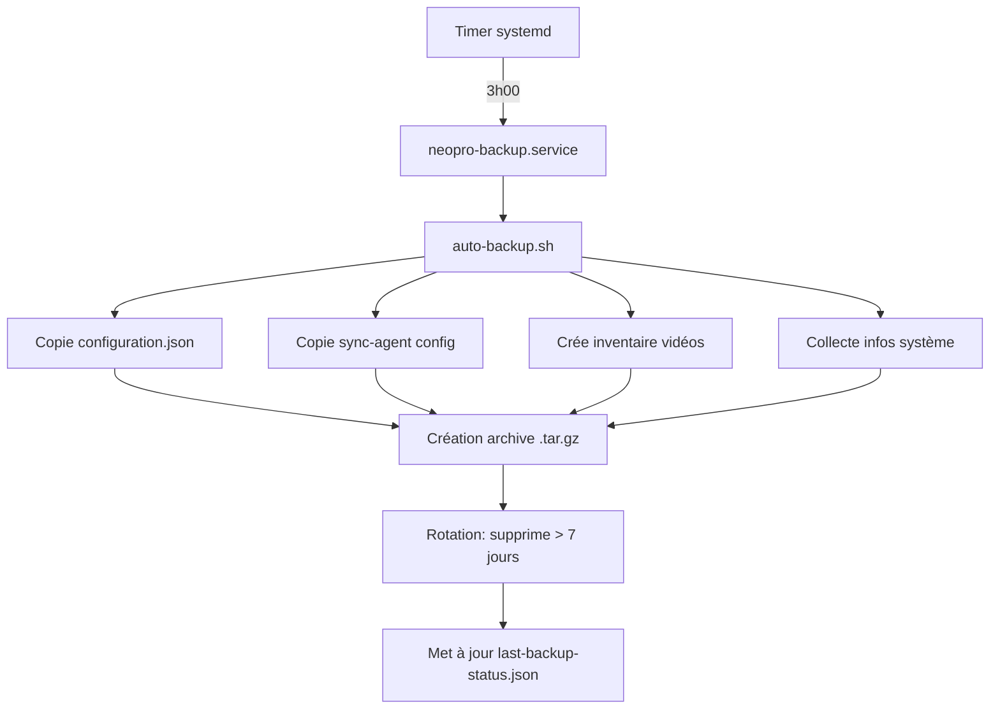

# Système de Backup Automatique Neopro

## 📋 Vue d'Ensemble

Système de sauvegarde automatique pour Raspberry Pi qui protège les configurations et données critiques du club.

---

## ✨ Fonctionnalités

### Backups Automatiques

- **Fréquence** : Quotidien à 3h00 du matin
- **Rétention** : 7 jours (configurable)
- **Taille** : ~500 KB à 2 MB (sans vidéos)
- **Résilience** : Rattrapage automatique si backup manqué

### Contenu Sauvegardé

| Élément | Chemin | Taille |
|---------|--------|--------|
| Configuration | `/home/pi/neopro/webapp/configuration.json` | ~100 KB |
| Sync Agent Config | `/home/pi/neopro/sync-agent/.env` | ~1 KB |
| Site Config | `/etc/neopro/site.conf` | ~1 KB |
| Inventaire Vidéos | Liste des fichiers (pas les fichiers) | ~10 KB |
| Info Système | État du système au moment du backup | ~1 KB |

### Gestion via Admin Panel

- ✅ Liste des backups disponibles
- ✅ Création de backup manuel
- ✅ Téléchargement de backups
- ✅ Suppression de backups
- ✅ Activation/Désactivation automatique
- ✅ Statut et logs en temps réel

---

## 🔧 Architecture Technique

### Composants

```
raspberry/
├── scripts/
│   ├── auto-backup.sh           # Script principal de backup
│   └── setup-auto-backup.sh     # Installation sur le Pi
├── systemd/
│   ├── neopro-backup.service    # Service systemd
│   └── neopro-backup.timer      # Timer quotidien
└── admin/
    └── admin-server.js          # API REST pour backups
```

### Flux de Backup



---

## 📁 Structure des Backups

### Répertoire

```
/home/pi/neopro-backups/
├── backup-20241218-030000.tar.gz    (Dernier)
├── backup-20241217-030000.tar.gz
├── backup-20241216-030000.tar.gz
├── ...
├── backup-20241211-030000.tar.gz    (Plus ancien conservé)
├── last-backup-status.json          (Statut JSON)
└── backup.log                       (Logs)
```

### Contenu d'une Archive

```
backup-20241218-030000/
├── configuration.json          # Config principale
├── sync-agent.env             # Variables sync-agent
├── site.conf                  # Config site
├── videos-inventory.txt       # Liste des vidéos
└── system-info.txt            # Infos système
```

### Statut JSON

```json
{
  "timestamp": "2024-12-18T03:00:00+01:00",
  "date": "2024-12-18",
  "success": true,
  "archive": "backup-20241218-030000.tar.gz",
  "size": "1.2 MB",
  "backups_count": 7,
  "retention_days": 7
}
```

---

## 🚀 Installation

### Depuis le PC de Développement

```bash
# À la racine du projet neopro
cd /path/to/neopro

# Installer le système de backup
./raspberry/scripts/setup-auto-backup.sh neopro.local

# Avec un backup de test
# Le script vous demandera si vous voulez créer un backup de test
```

### Installation Manuelle sur le Pi

```bash
# 1. Copier le script de backup
scp raspberry/scripts/auto-backup.sh pi@neopro.local:/tmp/
ssh pi@neopro.local "sudo mv /tmp/auto-backup.sh /home/pi/neopro/scripts/ && sudo chmod +x /home/pi/neopro/scripts/auto-backup.sh"

# 2. Copier les fichiers systemd
scp raspberry/systemd/neopro-backup.service pi@neopro.local:/tmp/
scp raspberry/systemd/neopro-backup.timer pi@neopro.local:/tmp/
ssh pi@neopro.local "sudo mv /tmp/neopro-backup.* /etc/systemd/system/ && sudo systemctl daemon-reload"

# 3. Activer le timer
ssh pi@neopro.local "sudo systemctl enable --now neopro-backup.timer"

# 4. Vérifier le statut
ssh pi@neopro.local "systemctl status neopro-backup.timer"
```

---

## 🎮 Utilisation

### Via l'Admin Panel

#### 1. Accéder à la Section Backups

```
http://neopro.local:8080 → Section "Backups"
```

#### 2. Créer un Backup Manuel

```javascript
// Frontend
await fetch('/api/backups/create', { method: 'POST' });
```

#### 3. Lister les Backups

```javascript
const response = await fetch('/api/backups');
const data = await response.json();
console.log(data.backups); // Liste des backups
console.log(data.status);  // Statut du dernier backup
```

#### 4. Télécharger un Backup

```
http://neopro.local:8080/api/backups/download/backup-20241218-030000.tar.gz
```

#### 5. Supprimer un Backup

```javascript
await fetch('/api/backups/backup-20241218-030000.tar.gz', {
  method: 'DELETE'
});
```

#### 6. Gérer l'Automatisation

```javascript
// Activer
await fetch('/api/backups/auto-toggle', {
  method: 'POST',
  headers: { 'Content-Type': 'application/json' },
  body: JSON.stringify({ enable: true })
});

// Désactiver
await fetch('/api/backups/auto-toggle', {
  method: 'POST',
  headers: { 'Content-Type': 'application/json' },
  body: JSON.stringify({ enable: false })
});

// Statut
const status = await fetch('/api/backups/auto-status').then(r => r.json());
console.log(status.enabled);  // true/false
console.log(status.nextRun);  // "Wed 2024-12-18 03:00:00 CET"
```

### Via SSH

#### Créer un Backup Manuellement

```bash
ssh pi@neopro.local "sudo bash /home/pi/neopro/scripts/auto-backup.sh"
```

#### Lister les Backups

```bash
ssh pi@neopro.local "ls -lh /home/pi/neopro-backups/"
```

#### Télécharger un Backup

```bash
scp pi@neopro.local:/home/pi/neopro-backups/backup-20241218-030000.tar.gz ./
```

#### Voir les Logs

```bash
# Logs du service
ssh pi@neopro.local "journalctl -u neopro-backup.service -n 50"

# Logs du script
ssh pi@neopro.local "tail -f /home/pi/neopro-backups/backup.log"
```

#### Statut du Timer

```bash
ssh pi@neopro.local "systemctl status neopro-backup.timer"
```

#### Activer/Désactiver

```bash
# Activer
ssh pi@neopro.local "sudo systemctl enable --now neopro-backup.timer"

# Désactiver
ssh pi@neopro.local "sudo systemctl disable --now neopro-backup.timer"
```

---

## 🔄 Restauration

### Restaurer une Configuration

```bash
# 1. Télécharger le backup
scp pi@neopro.local:/home/pi/neopro-backups/backup-20241218-030000.tar.gz ./

# 2. Extraire
tar -xzf backup-20241218-030000.tar.gz

# 3. Restaurer configuration.json
scp backup-20241218-030000/configuration.json pi@neopro.local:/home/pi/neopro/webapp/

# 4. Redémarrer l'app
ssh pi@neopro.local "sudo systemctl restart neopro-app"
```

### Restauration Complète

Utiliser le script existant :

```bash
./raspberry/scripts/restore-club.sh backup-20241218-030000.tar.gz neopro.local
```

---

## 📊 API REST

### GET /api/backups

Liste tous les backups disponibles.

**Réponse** :
```json
{
  "backups": [
    {
      "name": "backup-20241218-030000.tar.gz",
      "size": "1.2 MB",
      "sizeBytes": 1258291,
      "date": "2024-12-18 03:00:00",
      "created": "2024-12-18T03:00:00.000Z",
      "age": "0 jours"
    }
  ],
  "status": {
    "timestamp": "2024-12-18T03:00:00+01:00",
    "success": true,
    "archive": "backup-20241218-030000.tar.gz",
    "size": "1.2 MB"
  },
  "total": 7,
  "totalSize": 8808037
}
```

### POST /api/backups/create

Crée un backup manuel immédiatement.

**Réponse** :
```json
{
  "success": true,
  "message": "Backup créé avec succès",
  "output": "..."
}
```

### GET /api/backups/download/:filename

Télécharge un backup spécifique.

**Paramètres** :
- `filename` : Nom du fichier (ex: `backup-20241218-030000.tar.gz`)

### DELETE /api/backups/:filename

Supprime un backup.

**Paramètres** :
- `filename` : Nom du fichier à supprimer

**Réponse** :
```json
{
  "success": true,
  "message": "Backup supprimé"
}
```

### GET /api/backups/auto-status

Statut du système de backup automatique.

**Réponse** :
```json
{
  "enabled": true,
  "active": true,
  "nextRun": "Wed 2024-12-18 03:00:00 CET",
  "logs": "..."
}
```

### POST /api/backups/auto-toggle

Active ou désactive le backup automatique.

**Corps** :
```json
{
  "enable": true
}
```

**Réponse** :
```json
{
  "success": true,
  "message": "Backup automatique activé",
  "enabled": true
}
```

---

## ⚙️ Configuration

### Modifier la Fréquence

Éditer le timer systemd :

```bash
ssh pi@neopro.local "sudo nano /etc/systemd/system/neopro-backup.timer"
```

Exemples :

```ini
# Toutes les 12 heures
OnCalendar=0/12:00:00

# Tous les lundis à 2h00
OnCalendar=Mon *-*-* 02:00:00

# Toutes les heures
OnCalendar=hourly
```

Puis recharger :

```bash
ssh pi@neopro.local "sudo systemctl daemon-reload && sudo systemctl restart neopro-backup.timer"
```

### Modifier la Rétention

Éditer le script de backup :

```bash
ssh pi@neopro.local "sudo nano /home/pi/neopro/scripts/auto-backup.sh"

# Modifier la ligne :
RETENTION_DAYS=7  # → Changer à 14, 30, etc.
```

### Inclure les Vidéos

Par défaut, les vidéos ne sont **pas** sauvegardées (trop volumineuses).

Pour les inclure, modifier le script :

```bash
# Ajouter après l'inventaire des vidéos :
if [ -d "${NEOPRO_DIR}/videos" ]; then
    cp -r "${NEOPRO_DIR}/videos" "${BACKUP_DIR}/"
    log_success "Vidéos sauvegardées"
fi
```

⚠️ **Attention** : Cela peut créer des archives de plusieurs GB.

---

## 🔒 Sécurité

### Permissions

```bash
# Script de backup
-rwxr-xr-x  pi:pi  /home/pi/neopro/scripts/auto-backup.sh

# Répertoire de backups
drwxr-xr-x  pi:pi  /home/pi/neopro-backups/

# Fichiers systemd
-rw-r--r--  root:root  /etc/systemd/system/neopro-backup.service
-rw-r--r--  root:root  /etc/systemd/system/neopro-backup.timer
```

### Isolation

Le service systemd utilise des restrictions de sécurité :

```ini
NoNewPrivileges=true        # Pas d'escalade de privilèges
PrivateTmp=true             # /tmp isolé
ProtectSystem=strict        # Système en lecture seule
ReadWritePaths=/home/pi/neopro-backups  # Seul ce dossier est modifiable
```

### Validation des Fichiers

L'API valide les noms de fichiers avec regex :

```javascript
/^backup-\d{8}-\d{6}\.tar\.gz$/
```

Empêche les attaques par traversée de répertoire (`../`, etc.).

---

## 📈 Monitoring

### Métriques

Le fichier `last-backup-status.json` peut être utilisé pour monitoring :

```bash
# Vérifier si le dernier backup est récent (< 25h)
ssh pi@neopro.local "
  LAST_BACKUP=\$(cat /home/pi/neopro-backups/last-backup-status.json 2>/dev/null | jq -r '.timestamp')
  LAST_EPOCH=\$(date -d \"\$LAST_BACKUP\" +%s 2>/dev/null || echo 0)
  NOW_EPOCH=\$(date +%s)
  AGE=\$((NOW_EPOCH - LAST_EPOCH))
  if [ \$AGE -gt 90000 ]; then
    echo 'CRITICAL: Backup trop ancien'
    exit 2
  else
    echo 'OK: Backup récent'
    exit 0
  fi
"
```

### Alertes

Intégrer avec un système d'alerte (future feature) :

```bash
# Si le backup échoue, envoyer un email
if [ $? -ne 0 ]; then
    mail -s "Backup Neopro Failed" admin@club.com < /home/pi/neopro-backups/backup.log
fi
```

---

## 🧪 Tests

### Tester le Script de Backup

```bash
# Exécution manuelle
ssh pi@neopro.local "sudo bash /home/pi/neopro/scripts/auto-backup.sh"

# Vérifier la création
ssh pi@neopro.local "ls -lh /home/pi/neopro-backups/ | tail -1"
```

### Tester la Rotation

```bash
# Créer des backups de test avec des dates anciennes
ssh pi@neopro.local "
  cd /home/pi/neopro-backups
  touch -d '9 days ago' backup-20241209-030000.tar.gz
  touch -d '8 days ago' backup-20241210-030000.tar.gz
"

# Exécuter le backup (devrait supprimer les > 7 jours)
ssh pi@neopro.local "sudo bash /home/pi/neopro/scripts/auto-backup.sh"

# Vérifier
ssh pi@neopro.local "ls -lh /home/pi/neopro-backups/*.tar.gz"
```

### Tester la Restauration

```bash
# Extraire un backup
tar -xzf backup-20241218-030000.tar.gz

# Vérifier le contenu
ls -la backup-20241218-030000/
cat backup-20241218-030000/configuration.json | jq '.name'
```

---

## 🐛 Dépannage

### Le Timer ne Démarre pas

```bash
# Vérifier le statut
ssh pi@neopro.local "systemctl status neopro-backup.timer"

# Vérifier les erreurs
ssh pi@neopro.local "journalctl -u neopro-backup.timer -n 50"

# Recharger systemd
ssh pi@neopro.local "sudo systemctl daemon-reload && sudo systemctl restart neopro-backup.timer"
```

### Le Backup Échoue

```bash
# Voir les logs du service
ssh pi@neopro.local "journalctl -u neopro-backup.service -n 100"

# Voir les logs du script
ssh pi@neopro.local "cat /home/pi/neopro-backups/backup.log"

# Tester manuellement
ssh pi@neopro.local "sudo bash -x /home/pi/neopro/scripts/auto-backup.sh"
```

### Espace Disque Insuffisant

```bash
# Vérifier l'espace
ssh pi@neopro.local "df -h /home/pi"

# Réduire la rétention
ssh pi@neopro.local "sudo nano /home/pi/neopro/scripts/auto-backup.sh"
# RETENTION_DAYS=7 → RETENTION_DAYS=3

# Supprimer manuellement les vieux backups
ssh pi@neopro.local "sudo rm /home/pi/neopro-backups/backup-202412*.tar.gz"
```

### L'API ne Répond pas

```bash
# Vérifier que le serveur admin est actif
ssh pi@neopro.local "systemctl status neopro-admin"

# Tester l'API directement
curl http://neopro.local:8080/api/backups

# Vérifier les logs
ssh pi@neopro.local "journalctl -u neopro-admin -f"
```

---

## 🔮 Améliorations Futures

### Court Terme
- [ ] Interface UI dans l'admin panel
- [ ] Notifications email sur échec
- [ ] Backup différentiel (sauvegarder uniquement les changements)

### Moyen Terme
- [ ] Upload automatique vers cloud (S3, Google Drive)
- [ ] Chiffrement des backups
- [ ] Restauration en un clic depuis l'admin panel

### Long Terme
- [ ] Backup des vidéos de manière incrémentale
- [ ] Synchronisation multi-sites
- [ ] Dashboard de monitoring centralisé

---

## 📚 Ressources

- [systemd.timer](https://www.freedesktop.org/software/systemd/man/systemd.timer.html)
- [systemd.service](https://www.freedesktop.org/software/systemd/man/systemd.service.html)
- [tar compression](https://www.gnu.org/software/tar/manual/tar.html)

---

**Date de création** : 18 décembre 2025
**Version** : 1.0.0
**Auteur** : Claude (Anthropic)
**PR** : À créer
