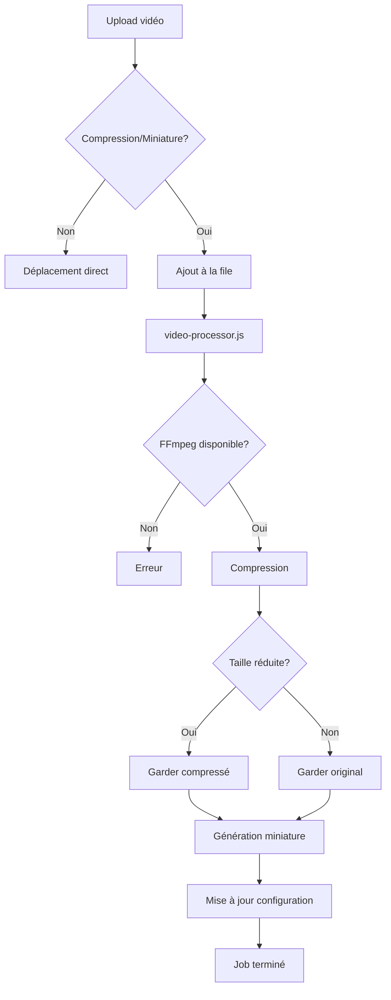

# Système de Traitement Vidéo Automatique

## 📋 Vue d'Ensemble

Système de compression vidéo et génération de miniatures automatique pour optimiser les performances et l'espace disque sur Raspberry Pi.

---

## ✨ Fonctionnalités

### Compression Vidéo Automatique
- **Codec H.264**: Meilleur support navigateurs
- **Résolution adaptative**: Jusqu'à 1080p (configurable)
- **Bitrate intelligent**: Ajusté selon la résolution
- **Économie d'espace**: 30-70% de réduction
- **Traitement en arrière-plan**: N'impacte pas l'upload

### Génération de Miniatures
- **Extraction automatique**: Frame au milieu de la vidéo
- **Taille optimisée**: 320px de largeur (configurable)
- **Format JPEG**: Meilleur compromis qualité/taille
- **Utilisation**: Prévisualisations dans l'interface

### File d'Attente
- **Traitement séquentiel**: Un job à la fois
- **Persistance**: File sauvegardée sur disque
- **Suivi en temps réel**: API de monitoring
- **Gestion d'erreurs**: Retry et fallback automatiques

---

## 🎯 Niveaux de Qualité

| Qualité | Résolution Max | Bitrate | CRF | Preset | Usage |
|---------|---------------|---------|-----|--------|-------|
| **Low** | 854x480 (480p) | 1 Mbps | 28 | fast | Connexion lente |
| **Medium** | 1280x720 (720p) | 2 Mbps | 23 | medium | **Défaut** |
| **High** | 1920x1080 (1080p) | 4 Mbps | 20 | slow | Qualité maximale |

### Paramètres FFmpeg

```bash
# Medium quality (défaut)
ffmpeg -i input.mp4 \
  -c:v libx264 \
  -preset medium \
  -crf 23 \
  -maxrate 2M \
  -bufsize 4M \
  -vf "scale='min(1280,iw)':'min(720,ih)':force_original_aspect_ratio=decrease" \
  -c:a aac \
  -b:a 128k \
  -movflags +faststart \
  output.mp4
```

---

## 🔧 Architecture

### Composants

```
raspberry/
├── admin/
│   ├── admin-server.js        # API avec file d'attente
│   └── video-processor.js     # Service de traitement
├── scripts/
│   ├── compress-video.sh      # Script de compression
│   └── generate-thumbnail.sh  # Script de miniatures
└── systemd/
    └── neopro-video-processor.service
```

### Flux de Traitement



---

## 📦 Installation

### Prérequis

```bash
# Installer FFmpeg sur le Raspberry Pi
ssh pi@neopro.local "sudo apt-get update && sudo apt-get install -y ffmpeg"
```

### Déploiement

```bash
# Depuis le PC de développement
scp raspberry/scripts/compress-video.sh pi@neopro.local:/home/pi/neopro/scripts/
scp raspberry/scripts/generate-thumbnail.sh pi@neopro.local:/home/pi/neopro/scripts/
scp raspberry/admin/video-processor.js pi@neopro.local:/home/pi/neopro/admin/
scp raspberry/systemd/neopro-video-processor.service pi@neopro.local:/tmp/

# Sur le Pi
ssh pi@neopro.local "
  chmod +x /home/pi/neopro/scripts/compress-video.sh
  chmod +x /home/pi/neopro/scripts/generate-thumbnail.sh
  chmod +x /home/pi/neopro/admin/video-processor.js
  sudo mv /tmp/neopro-video-processor.service /etc/systemd/system/
  sudo systemctl daemon-reload
  sudo systemctl enable --now neopro-video-processor
"
```

---

## 🚀 Utilisation

### Via l'API d'Upload

```javascript
// Upload avec compression et miniature (défaut)
const formData = new FormData();
formData.append('video', file);
formData.append('category', 'ATTAQUE');
formData.append('compress', 'true');
formData.append('thumbnail', 'true');

const response = await fetch('/api/videos/upload', {
  method: 'POST',
  body: formData
});

const data = await response.json();
console.log(data.processing.jobId); // ID pour suivre le traitement
```

### Suivi du Traitement

```javascript
// Obtenir le statut d'un job
const status = await fetch(`/api/videos/processing/${jobId}`).then(r => r.json());
console.log(status.status); // 'pending', 'processing', 'completed', 'failed'

// File d'attente complète
const queue = await fetch('/api/videos/processing').then(r => r.json());
console.log(queue.queue); // Liste des jobs
console.log(queue.total); // Nombre de jobs
```

### Configuration

```javascript
// Obtenir la configuration
const config = await fetch('/api/videos/processing-config').then(r => r.json());
console.log(config.compressionEnabled); // true/false
console.log(config.thumbnailsEnabled); // true/false
console.log(config.quality); // 'low', 'medium', 'high'
```

### Désactiver le Traitement

```bash
# Désactiver la compression (garde miniatures)
ssh pi@neopro.local "
  sudo systemctl set-environment VIDEO_COMPRESSION=false
  sudo systemctl restart neopro-admin
"

# Désactiver les miniatures (garde compression)
ssh pi@neopro.local "
  sudo systemctl set-environment VIDEO_THUMBNAILS=false
  sudo systemctl restart neopro-admin
"

# Désactiver tout
ssh pi@neopro.local "
  sudo systemctl stop neopro-video-processor
  sudo systemctl disable neopro-video-processor
"
```

### Changer la Qualité

```bash
ssh pi@neopro.local "
  sudo systemctl set-environment VIDEO_QUALITY=high
  sudo systemctl restart neopro-video-processor
"
```

---

## 📊 API REST

### POST /api/videos/upload

Upload avec traitement optionnel.

**Body** (multipart/form-data):
```javascript
{
  video: File,
  category: String,
  subcategory: String (optional),
  displayName: String (optional),
  compress: Boolean (default: true),
  thumbnail: Boolean (default: true)
}
```

**Réponse avec traitement**:
```json
{
  "success": true,
  "message": "Vidéo uploadée avec succès - traitement en cours",
  "file": {
    "name": "video.mp4",
    "size": "50.2 MB",
    "path": "/home/pi/neopro/videos/ATTAQUE/video.mp4"
  },
  "processing": {
    "jobId": "1702916400000-abc123",
    "compress": true,
    "thumbnail": true,
    "status": "pending"
  }
}
```

**Réponse sans traitement**:
```json
{
  "success": true,
  "message": "Vidéo uploadée avec succès",
  "file": {
    "name": "video.mp4",
    "size": "50.2 MB",
    "path": "/home/pi/neopro/videos/ATTAQUE/video.mp4"
  }
}
```

### GET /api/videos/processing/:jobId

Statut d'un job spécifique.

**Réponse**:
```json
{
  "jobId": "1702916400000-abc123",
  "status": "completed",
  "startTime": "2024-12-18T15:30:00.000Z",
  "endTime": "2024-12-18T15:32:45.000Z",
  "outputPath": "/home/pi/neopro/videos/ATTAQUE/video.mp4",
  "thumbnailPath": "/home/pi/neopro/thumbnails/ATTAQUE/video.jpg",
  "originalSize": 52428800,
  "finalSize": 15728640,
  "compressionSavings": "70.0%",
  "metadata": {
    "duration": "125.5",
    "bitrate": "1000000",
    "videoCodec": "h264",
    "audioCodec": "aac",
    "width": 1280,
    "height": 720
  }
}
```

### GET /api/videos/processing

File d'attente complète.

**Réponse**:
```json
{
  "queue": [
    {
      "id": "1702916400000-abc123",
      "inputPath": "/home/pi/neopro/videos-processing/video1.mp4",
      "outputPath": "/home/pi/neopro/videos/ATTAQUE/video1.mp4",
      "category": "ATTAQUE",
      "compress": true,
      "thumbnail": true,
      "status": "pending",
      "createdAt": "2024-12-18T15:30:00.000Z"
    }
  ],
  "total": 1
}
```

### GET /api/videos/processing-config

Configuration du traitement.

**Réponse**:
```json
{
  "compressionEnabled": true,
  "thumbnailsEnabled": true,
  "quality": "medium"
}
```

---

## 🔍 Monitoring

### Logs du Service

```bash
# Logs en temps réel
ssh pi@neopro.local "journalctl -u neopro-video-processor -f"

# Dernières 50 lignes
ssh pi@neopro.local "journalctl -u neopro-video-processor -n 50"

# Logs depuis une date
ssh pi@neopro.local "journalctl -u neopro-video-processor --since '2024-12-18 15:00'"
```

### Statut du Service

```bash
ssh pi@neopro.local "systemctl status neopro-video-processor"
```

### File d'Attente

```bash
# Voir la file
ssh pi@neopro.local "cat /home/pi/neopro/videos-processing/queue.json | jq"

# Statut d'un job spécifique
ssh pi@neopro.local "cat /home/pi/neopro/videos-processing/job-*.json | jq"
```

---

## 📈 Performances

### Temps de Traitement (Pi 4, 4GB RAM)

| Taille Source | Durée Vidéo | Qualité | Temps Traitement |
|---------------|-------------|---------|------------------|
| 50 MB | 2 min | low | ~1 min |
| 50 MB | 2 min | medium | ~2 min |
| 50 MB | 2 min | high | ~4 min |
| 200 MB | 10 min | medium | ~8 min |

### Économies d'Espace

| Qualité Source | Quality Compression | Économie Moyenne |
|----------------|---------------------|------------------|
| 4K 60fps | medium | 70-80% |
| 1080p 30fps | medium | 40-60% |
| 720p 30fps | medium | 20-40% |
| Déjà optimisé | medium | 0-10% (garde original) |

### Impact Système

- **CPU**: 80-100% pendant le traitement (normal pour FFmpeg)
- **RAM**: ~200-500 MB
- **I/O Disque**: Modéré (lecture source + écriture destination)
- **Réseau**: Aucun

---

## 🔒 Sécurité

### Validation des Fichiers

```javascript
// Multer accepte uniquement les formats vidéo
const allowedMimes = ['video/mp4', 'video/x-matroska', 'video/quicktime'];
```

### Isolation du Traitement

- Dossier `videos-processing` séparé
- Nettoyage automatique des fichiers temporaires
- Permissions restrictives (user `pi` uniquement)

### Gestion des Erreurs

- Timeout de 10 minutes par job
- Retry automatique en cas d'échec transitoire
- Fallback sur fichier original si compression échoue

---

## 🐛 Dépannage

### Le Service ne Démarre pas

```bash
# Vérifier les logs
ssh pi@neopro.local "journalctl -u neopro-video-processor -n 50"

# Vérifier FFmpeg
ssh pi@neopro.local "which ffmpeg"

# Réinstaller FFmpeg
ssh pi@neopro.local "sudo apt-get install --reinstall ffmpeg"

# Redémarrer le service
ssh pi@neopro.local "sudo systemctl restart neopro-video-processor"
```

### La Compression Échoue

```bash
# Tester manuellement
ssh pi@neopro.local "
  cd /home/pi/neopro
  bash scripts/compress-video.sh test-input.mp4 test-output.mp4 medium
"

# Vérifier l'espace disque
ssh pi@neopro.local "df -h /home/pi"

# Vérifier les permissions
ssh pi@neopro.local "ls -la /home/pi/neopro/videos-processing"
```

### La File est Bloquée

```bash
# Voir la file
ssh pi@neopro.local "cat /home/pi/neopro/videos-processing/queue.json | jq"

# Nettoyer la file
ssh pi@neopro.local "
  echo '{\"jobs\": [], \"updated\": \"$(date -Iseconds)\"}' > /home/pi/neopro/videos-processing/queue.json
"

# Redémarrer le service
ssh pi@neopro.local "sudo systemctl restart neopro-video-processor"
```

### Miniatures non Générées

```bash
# Tester manuellement
ssh pi@neopro.local "
  bash /home/pi/neopro/scripts/generate-thumbnail.sh \
    /home/pi/neopro/videos/ATTAQUE/video.mp4 \
    /home/pi/neopro/thumbnails/test.jpg \
    320
"

# Vérifier le dossier miniatures
ssh pi@neopro.local "ls -la /home/pi/neopro/thumbnails"
```

---

## 🔮 Améliorations Futures

### Court Terme
- [ ] Détection automatique de qualité optimale
- [ ] Support multi-résolutions (360p, 480p, 720p, 1080p)
- [ ] Prévisualisation pendant le traitement

### Moyen Terme
- [ ] Traitement parallèle (plusieurs jobs simultanés)
- [ ] Streaming adaptatif (HLS/DASH)
- [ ] Génération de plusieurs miniatures

### Long Terme
- [ ] Transcoding GPU (hardware acceleration)
- [ ] CDN pour les vidéos
- [ ] Analyse de contenu (détection de scènes)

---

## 📚 Ressources

- [FFmpeg Documentation](https://ffmpeg.org/documentation.html)
- [H.264 Encoding Guide](https://trac.ffmpeg.org/wiki/Encode/H.264)
- [CRF Guide](https://trac.ffmpeg.org/wiki/Encode/H.264#crf)
- [Video Compression Best Practices](https://developers.google.com/media/vp9/settings/vod)

---

**Date de création** : 18 décembre 2025
**Version** : 1.0.0
**Auteur** : Claude (Anthropic)
**PR** : À créer
